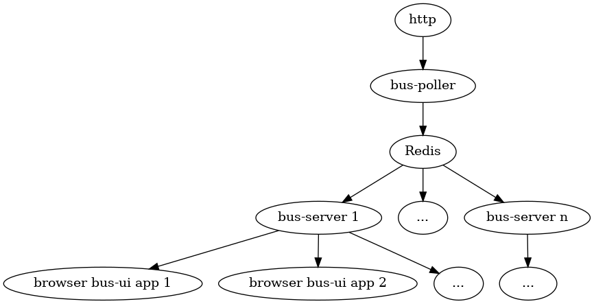

# Docker

Docker is a set of platform as a service tools that use OS-level virtualization to deliver software packages called containers.


## App/container evolution


## Docker runtime

Executes the images as containers. Containers are isolated from one another; they can communicate with each other through well-defined channels. All containers are run by a single operating system kernel and therefore use fewer resources than virtual machines.

## Docker image format

A container is a standard unit of software that packages up code and all its dependencies so the application runs quickly and reliably from one computing environment to another.

Docker container packages use docker image format, which is standardized as OCI (Open Container Format). Images up of series of filesystem layers; each layer adds, removes or modifies files from the preceding layer (e.g. overlay filesystem).

Container images are typically combined with a container configuration file (i.e. Dockerfile), which provides instructions on how to set up the container environment and execute an application entry point.

System containers seek to mimic virtual machines and often run a full boot process.
They often include a set of system services typically found in a VM, such as ssh, cron, and syslog. Application containers differ from system containers in that they commonly run a single program.


## Commands

```bash
# Pull image
docker pull portainer/portainer

# Start a container interactively
docker run -it 

# Start in background with bind mounts and volumes
docker volume create portainer_data
docker run -d -p 9000:9000 -p 8000:8000 \
  --name portainer --restart always \
  -v /var/run/docker.sock:/var/run/docker.sock \
  --mount source=portainer_data,target=/data \
  portainer/portainer

# Run a command
docker exec -it container-redis sh

# Images
docker images
docker image history portainer/portainer
docker image inspect portainer/portainer
docker image rm portainer/portainer

# Other commands
docker build ...
docker push ...
docker push ...
docker ps
docker network ls
docker network inspect bridge --format='{{( index .IPAM.Config 0).Gateway}}'
docker log ...

```

## Demo



Demo application as stand-alone and packaged as docker images.

## docker-compose

Tool for defining and running multi-container Docker applications.

Demo - app as a docker-compose application.

## Supporting tools

- Portainer
- dive
- lazydocker

## Best practices

- Optimize image sizes

  Docker image size is very important:

  - network latency – need to transfer Docker image over the web
  - storage – need to store all these bits somewhere
  - service availability and elasticity – when using a Docker scheduler, like Kubernetes, Swarm, Nomad, DC/OS or other (the scheduler can move  containers between hosts)
  - security – do you really, I mean really need the libpng package with all its CVE vulnerabilities for your Java application?
  - development agility – small Docker images == faster build time and faster deployment

- Security

  - no secrets in images

- Multistage builds

  - Optimizes size: build toolchain is not included in runtime image

- Continuous integration

  - New images built on each commit
  - Images stored in remote registry like Dockerhub, Google Container Registry or private registry


## Docker Container Runtime

Container runtime executes 

## Tools

dive
portainer


## Dev environment patterns

### Bind services to host computer

Service-to-service calls can be configured via host (e.g. service can access app-service1 via special DNS name host.docker.internal:9020,
i.e. using address http://host.docker.internal:9020).

```Docker
version: "2.4"
services:
  app-db:
    container_name: app-db
    hostname: app-db
    image: user/app-db:12
    environment:
      - POSTGRES_USER=postgres
      - POSTGRES_PASSWORD=postgres
    networks:
      app:
        ipv4_address: 172.16.238.2
        ipv6_address: 2001:3984:3989::2
    ports:
      - "25432:5432"

  ...

  app-service1:
    container_name: app-service1
    depends_on:
      - "app-db"
    environment:
      DB_PWD: "${RESOURCES_DB_PWD}"
    hostname: service1
    image: user/service1:DEVELOP-SNAPSHOT
    networks:
      app:
        ipv4_address: 172.16.238.20
        ipv6_address: 2001:3984:3989::20
    ports:
      - "9020:8080"
networks:
  app:
    driver: bridge
    enable_ipv6: true
    name: app_network
    ipam:
      driver: default
      config:
        - subnet: 172.16.238.0/24
          gateway: 172.16.238.1
        - subnet: 2001:3984:3989::/64
          gateway: 2001:3984:3989::1
```

### Use shared folders with hot reloading
